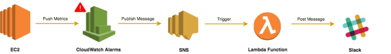

# Integration of Slack notfications, AWS SNS, AWS CloudWatch

- This is a deployment package of an AWS lambda function. 
- Slack_NOtification.java is the lambda function which simply forwards the http request to the Slack webhook.

## Steps to use

-Set up a CloudWatch alarm which gets triggered when the given threshold of your favorite metric is met. 
-Create an SNS topic with endpoint as the lambda function. 
-Create a slack webhook and replace it with the current webhook url in the lambda function. 
-Create deployment package, upload and you are all set. 
You would get a slack message when threshold is crossed. 

### Flow of the project

